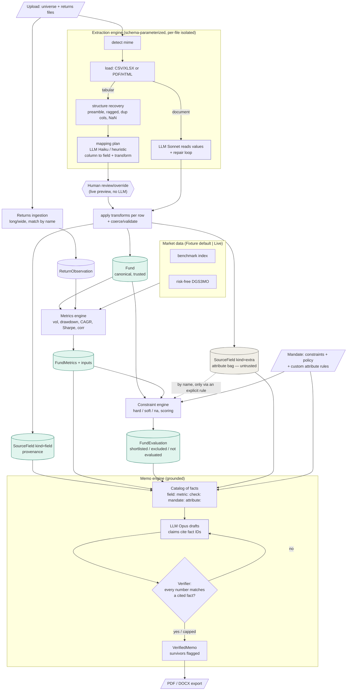
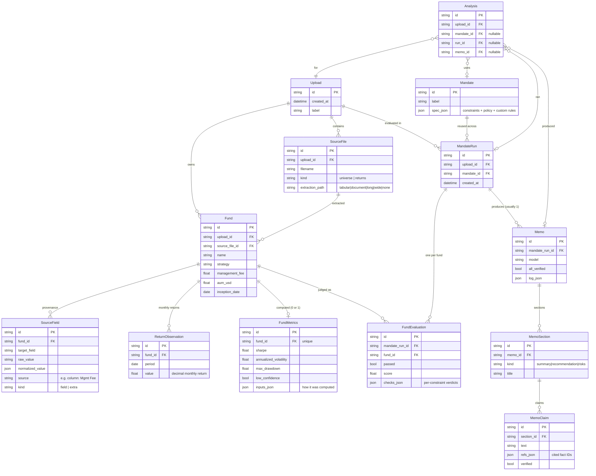
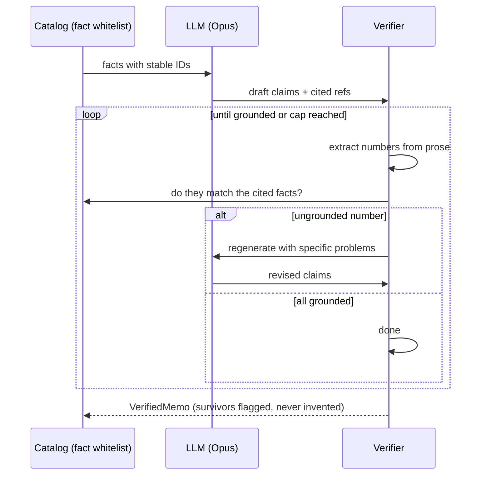

# Design & Architecture

> Setup and folder layout live in the root [`README.md`](../README.md). This
> document is the *why* and the *how*: the thesis, the engines, the data model,
> the guiding principles, and the assumptions.

---

## 1. The thesis

Take a messy, varied fund-universe dataset + a mandate, normalize and validate the
data, compute real finance metrics, and have an LLM write an investment-committee
memo where **every claim traces back to a computed metric or a source field**.
Nothing the model invents survives.

The organizing principle that makes that possible:

> **The Python backend is a deterministic compute spine. The LLM only ever
> *recognizes* how to map a column or *narrates* values the code already produced —
> it never transcribes or invents numbers.** That is what makes the audit trail
> real.

Everything below is in service of that property.

---

## 2. Tech stack

### Backend (Python)

| Area | Libraries | Why |
|---|---|---|
| Web | **FastAPI**, **Uvicorn**, `python-multipart` | Async API + ASGI server; multipart file uploads |
| Contracts & validation | **Pydantic v2** | Canonical schemas (`Fund`, `MandateSpec`, mapping plan), coercion, soft/hard issue split |
| Persistence | **SQLAlchemy 2.0** over **SQLite** | ORM + audit model; swappable via `DATABASE_URL` |
| Data & math | **pandas**, **numpy** | Grid/structure recovery, returns reshaping, metric computation |
| LLM | **anthropic** (Python SDK) | Structured output via tool use — Haiku (mapping), Sonnet (document), Opus (memo) |
| Loaders / parsing | **openpyxl** (xlsx), **filetype** (mime from bytes, no libmagic), **charset-normalizer** (encoding), **beautifulsoup4** + **lxml** + **trafilatura** (HTML), **pymupdf4llm** (PDF→markdown), **python-dateutil** (dates) | The format-agnostic input layer |
| Market data (live mode) | **yfinance** (index benchmarks), **requests** (FRED `DGS3MO` CSV, certifi SSL) | Lazy-imported; fixture mode needs neither |
| Export | **fpdf2** (PDF), **python-docx** (DOCX) | Memo download |
| Tooling | **python-dotenv**, **pytest** | Env loading; hermetic test suite |

### Frontend (TypeScript)

| Area | Libraries | Why |
|---|---|---|
| Framework | **Next.js 14** (App Router), **React 18** | The UI |
| Styling | **Tailwind CSS 3** (+ `tailwindcss-animate`, `postcss`, `autoprefixer`) | Utility-first styling |
| Components | **shadcn/ui pattern** on **Radix UI** primitives (dialog, select, checkbox, label, tooltip, scroll-area, separator, slot) | Accessible, unstyled primitives we theme |
| Class composition | **class-variance-authority**, **clsx**, **tailwind-merge** | Component variants + safe class merging |
| Icons | **lucide-react** | Iconography |
| Language | **TypeScript 5** | Typed contracts mirroring the backend schemas |

Deliberately *not* used on the frontend: no data-fetching/state library (plain
`fetch` + React state) and no generated API client (hand-written types in
[`web/app/types.ts`](../web/app/types.ts)) — kept lightweight for the scaffold.

---

## 3. High-level architecture

The system is a pipeline. The frontend wizard ([`web/app/components/NewAnalysisWizard.tsx`](../web/app/components/NewAnalysisWizard.tsx))
walks four steps; under it the backend runs these stages, each persisting to SQLite:

1. **Upload + plan** (`POST /extract/plan`) — load each file, recover structure,
   propose a column→field mapping, preview the result. **Persists nothing.**
2. **Mapping review** — a human confirms/edits the mapping; preview recomputes live.
3. **Commit** (`POST /extract`) — apply the approved plan deterministically, persist
   `Upload → SourceFile → Fund → SourceField`. Unmapped columns become attributes.
4. **Returns ingest** (`POST /uploads/{id}/returns`) — parse long/wide return files,
   link to funds by name.
5. **Metrics** (`POST /uploads/{id}/metrics`) — pull benchmark + risk-free, compute
   per-fund metrics, persist `FundMetrics`.
6. **Evaluate** (`POST /uploads/{id}/runs`) — the constraint engine judges each fund
   (hard/soft/na) into a ranked `MandateRun`.
7. **Memo** (`POST /runs/{id}/memo`) — build a grounding catalog, draft claims that
   cite fact IDs, verify every number, regenerate ungrounded claims, persist `Memo`.
   `GET /memos/{id}/export` renders PDF/DOCX.

### Data flow, end to end

Three colours carry the trust model: **green = trusted** (canonical fields,
metrics, evaluations — these flow into decisions); **gray = the attribute bag**
(untrusted, display/cite only — the dashed line means it only reaches the engine
via an *explicit* user-defined rule); **purple = the three LLM touchpoints**
(mapping plan, document read, memo draft), each boxed so the model never directly
produces a number that reaches a decision.

---

## 4. The data model

`SourceField` is the audit backbone: one row per extracted value, holding both
`raw_value` and `normalized_value`, where it came from, and a `kind` (`field` =
trusted/mapped; `extra` = untrusted attribute). Metrics store their `inputs_json`
(how they were computed). Provenance is captured at ingest time so the memo never
has to reverse-engineer where a number came from.

Crow's-foot cardinality: `||` = exactly one, `o{` = zero-or-many (the fork points
at the "many" side), `o|` = zero-or-one.

Notes:
- `Fund` carries a direct `upload_id` *and* a `source_file_id` (convenience FK to
  query an upload's funds without joining through `SourceFile`).
- `MandateRun` belongs to **both** an Upload and a Mandate — the join point where
  "these funds" meet "these constraints."
- `Analysis` is the **lifecycle wrapper** with nullable FKs that fill in as the
  wizard progresses; it's the row you see in the Analyses table.
- One table isn't drawn because it links to nothing: `BenchmarkSeries`
  (`ticker, period, value`) is a standalone market-data cache.

---

## 5. The engines

### 5.1 Extraction engine — [`api/app/extraction/`](../api/app/extraction/)

The headline reliability pattern. [`engine.py`](../api/app/extraction/engine.py)
`extract(raw, filename, target, plan=None)` is **schema-parameterized** (pass a
different target model and it serves a different product) and **per-file isolated**
(catches exceptions, returns `strategy="none"` rather than crashing a batch). It
routes to one of two paths:

**Tabular path (CSV/XLSX):** `detect → load → recover_grid → mapping plan → apply
transforms → validate`.

- **Structure recovery** ([`structure.py`](../api/app/extraction/structure.py)):
  `recover_grid` finds the real table inside an adversarial grid — drops blank
  rows, skips comment/title preamble to locate the header, reconciles ragged rows
  to the modal width, de-duplicates column names, normalizes `NaN`→empty. It
  *never raises*; worst case an empty frame + a note.
- **Mapping** ([`mapping/tabular.py`](../api/app/extraction/mapping/tabular.py)):
  the LLM (or the offline heuristic) produces a *mapping plan* — column→field +
  transform — from the **headers and ~8 sample rows only**. It never sees the
  full data. Code then applies that plan to every row. So numbers stay exact, the
  whole table costs one cheap LLM call regardless of length, and the model is
  never in a position to transcribe a value wrong. The transform is chosen from
  the *form* of the sample values (`"2%"` → `percent_to_decimal`, `"150 bps"` →
  `bps_to_decimal`, `"0.02"` → `none`). Offline, [`heuristic.py`](../api/app/extraction/mapping/heuristic.py)
  does the same with header synonyms + value-aware transform guessing.
- Columns the plan doesn't map become the **attribute bag** (`kind="extra"`).

**Document path (PDF/HTML):** the LLM (Sonnet) *reads values directly* with a
repair loop ([`repair.py`](../api/app/extraction/repair.py)) — used only when
there is no column grid. This is the one path where the model reads values, so it
carries the re-prompt-on-validation-error loop.

### 5.2 Returns ingestion — [`api/app/returns/ingest.py`](../api/app/returns/ingest.py)

Detects shape deterministically (no LLM — date-parsing headers vs cells): **long**
(`fund, date, return` rows) or **wide-by-date** (date columns, melted to long).
Normalizes returns to decimals and periods to the first of the month, links each
series to a fund **by normalized name**, and is idempotent (upsert per
`(fund, period)`). Unmatched series are reported, not fatal.

### 5.3 Metrics engine — [`api/app/metrics/functions.py`](../api/app/metrics/functions.py)

Pure functions over the monthly return series: annualized vol = `stdev(ddof=1)×√12`,
path-dependent max drawdown, CAGR, Sharpe = `(CAGR − rf)/vol`, Pearson correlation
to benchmark. Computed **only** from return series — never from the LLM. Flags
`low_confidence` when n < 12 observations.

### 5.4 Market data — [`api/app/market/`](../api/app/market/)

Two providers behind one interface: **FixtureProvider** (deterministic synthetic —
the default, hermetic, no network) and **LiveProvider** (yfinance for index
benchmarks; FRED `DGS3MO` via `requests` for the risk-free rate, no API key).
Toggled by `MARKET_DATA=fixture|live`. Results cache in `BenchmarkSeries` so each
`(ticker, month)` is fetched at most once. Fund-intrinsic metrics (vol, drawdown,
CAGR) are real regardless of mode; only Sharpe's risk-free term and benchmark
correlation depend on the setting.

### 5.5 Constraint engine — [`api/app/constraints/engine.py`](../api/app/constraints/engine.py)

Pure mechanism, no LLM. Each constraint returns a `ConstraintCheck`:

- **hard** — a violation eliminates the fund from the shortlist;
- **soft** — a violation subtracts a penalty from a 100-point score;
- **na** — the check can't be made (the fund is missing the data, or its risk
  metric is low-confidence). `na` **never** eliminates or penalizes — *"missing ≠
  wrong."*

Severity and penalty are **policy owned by the mandate**, not hardcoded in the
engine. Every check carries a human-readable `reason` and the `source_fields` it
judged, so a verdict is computed and traceable — these become grounded claims in
the memo. **Custom/promoted-attribute rules** apply generic operators
(`≥ ≤ = contains` …) to attribute-bag values, always flagged "reported." The
degenerate "every check is na" case is surfaced as **"Not evaluated"** at the
presentation layer (it keeps the fund off the shortlist without faking a pass or
stamping a failure).

### 5.6 Memo engine — [`api/app/memo/`](../api/app/memo/)

The grounding system, in three parts:

- **Catalog** ([`catalog.py`](../api/app/memo/catalog.py)): assembles every citable
  fact with a stable ID — `field:`, `metric:`, `check:`, `mandate:`, `attribute:`.
  This is both the LLM's input *and* the verifier's whitelist.
- **Generate** ([`generate.py`](../api/app/memo/generate.py)): the LLM (Opus) drafts
  sections of claims, each carrying the fact IDs (`refs`) it rests on.
- **Verify** ([`verify.py`](../api/app/memo/verify.py) + [`numbers.py`](../api/app/memo/numbers.py)):
  extracts every number from a claim's prose and checks it matches a cited fact's
  value. Ungrounded claims trigger **reject-and-regenerate** (capped); survivors
  are **flagged, not silently dropped**.

---

## 6. The layered user-control model

A recurring theme: keep a vetted fixed core, and make everything else an
extensible layer the user drives — so allocators get flexibility without
dissolving the trust guarantees. Four layers, most-trusted to least:

1. **Core canonical schema** — fixed in [`schemas/fund.py`](../api/app/schemas/fund.py),
   with hand-tuned per-field constraint logic. Feeds metrics + constraints.
2. **Mapping review/override** — the human confirms or corrects the LLM's
   column→field plan before anything persists (the two-phase `plan`/`commit`
   split). Same trusted core schema.
3. **Promoted attributes** — the user declares a type + a generic rule on an
   attribute-bag column (e.g. "reported Sortino ≥ 1.0"), judged by a generic
   operator and always labeled "reported." Never the hand-tuned checks.
4. **Attribute bag** — unmapped columns captured verbatim: untrusted, display +
   cite only, never computed.

This is why the dashed line in the data-flow diagram is the *only* way an attribute
reaches a decision — and only when a user explicitly promotes it.

---

## 7. Guiding principles

- **The LLM recognizes, it never transcribes.** On the tabular path it emits a
  mapping *plan*; code applies it. The model is structurally incapable of
  fat-fingering a number that reaches a decision.
- **Provenance at ingest, not bolted on.** Every value stores its origin, so the
  audit trail is real, not reconstructed.
- **Missing ≠ wrong.** A check that can't be made is `na` — it never penalizes or
  eliminates.
- **The trust wall.** Untrusted, as-reported data (the attribute bag) is displayed
  and citable but never feeds metrics or constraints unless a human explicitly
  promotes it — and even then it's labeled "reported."
- **Graceful degradation.** Structure recovery never hard-fails; per-file
  extraction is isolated; a bad file is reported, not fatal.
- **Determinism where it counts.** Shape detection, transforms, metrics, and
  constraint evaluation are all pure code; the offline path runs the whole tabular
  pipeline with no API key.
- **Policy vs mechanism.** The constraint engine is mechanism; severity, penalties,
  and custom rules are policy the mandate owns.

---

## 8. Assumptions & known limits

- **Returns link to funds by normalized name** → two funds with the same name
  collide (the documented entity-resolution limit).
- **Fees stored as decimals** (2% → 0.02); **monthly** returns, annualized with √12;
  risk-free from **DGS3MO**.
- **Promoted attributes match by name; missing → na**, and percentages are compared
  in *reported* units (no implicit %→decimal on attributes).
- **XLSX uses the first non-empty sheet**; other sheets are recorded, not merged.
- **Mandates are upload-independent** (reusable), so custom-rule attribute names are
  free-text (with suggestions when an upload is in context).
- The mapping sample is ~8 rows; a column that's empty or ambiguous in those rows
  relies on the human review step + per-mapping confidence to catch.

---

## 9. Deliberate scope cuts

- **Synchronous request/response**, no task queue — keeps the flow legible for a
  take-home; production would move extraction + memo to a worker.
- **SQLite** over a warehouse — right-sized; swappable via `DATABASE_URL`.
- **No migrations tool** — schema is created on startup; a model change means
  deleting the `.db`.
- **No auth / multi-user / deployment.**

---

## 10. Testing

~160 tests, fully **hermetic**: a conftest fixture forces the offline LLM
heuristic and synthetic market data, so the suite never makes network calls. It
covers extraction (incl. adversarial structure recovery + the attribute bag),
transforms, returns ingestion, metrics, the constraint engine (hard/soft/na,
custom rules), persistence, the mapping plan/commit endpoints, and the memo
grounding/verifier. Run with `cd api && .venv/bin/python -m pytest`.
